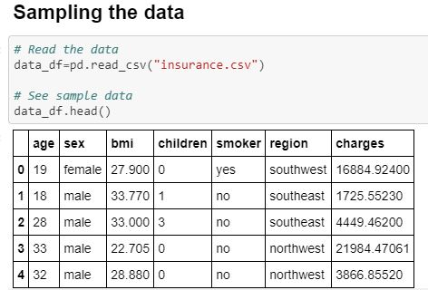
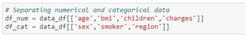
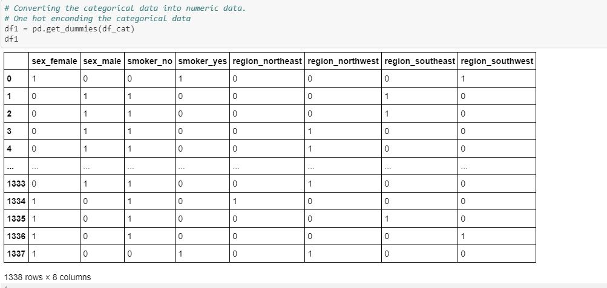
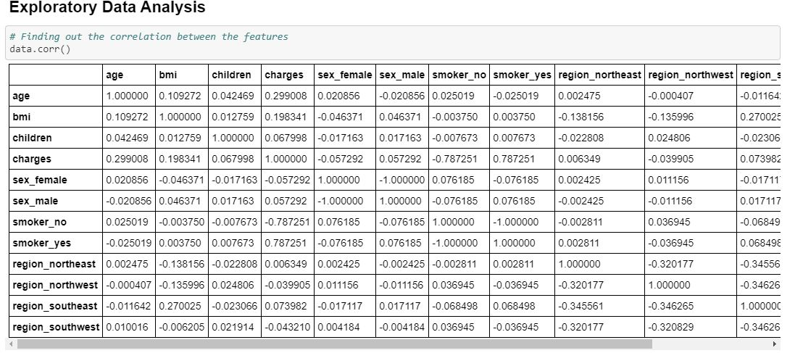
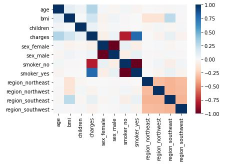
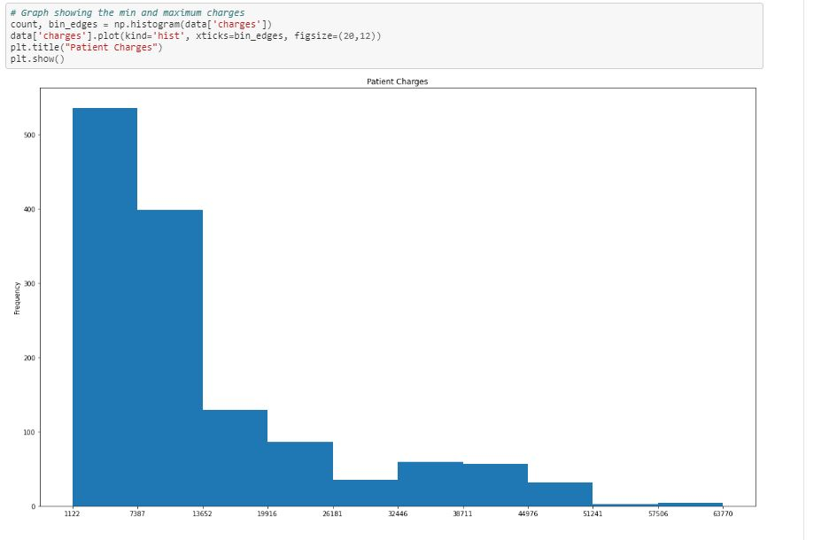
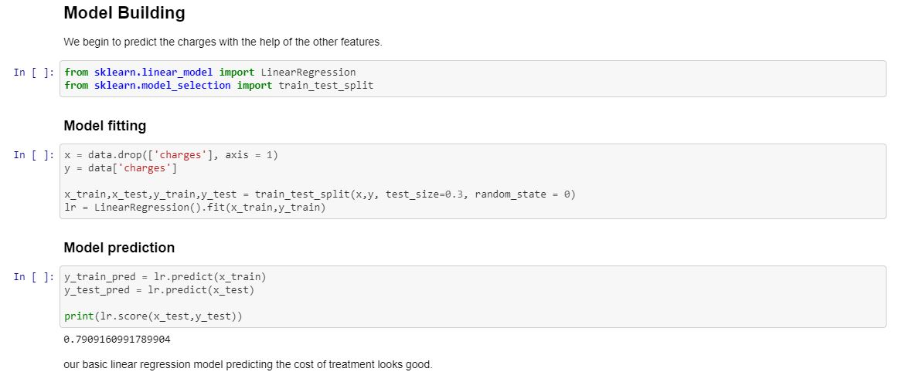
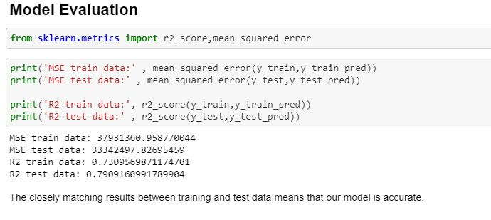

# Linear Regression on Personal Health Data

## Aim

To build a linear regression model based on personal health data and explore any trends we may find.

## Motivation
Hi all, This is my first notebook. I am trying to perform Exploratory Data Analysis (EDA) and linear regression on personal health data set end to end. Any feedback and constuctive feedback is appreciated hosted on Kaggle. Link to the Dataset: https://www.kaggle.com/mirichoi0218/insurance

## Table of contents
- [Components](https://github.com/Thomas-George-T/Linear-Regression-on-Personal-Health-Data#Components)
- [Model Implementation](https://github.com/Thomas-George-T/Linear-Regression-on-Personal-Health-Data#model-implementation)
  1. [Import Data](https://github.com/Thomas-George-T/Linear-Regression-on-Personal-Health-Data#1-import-data)
  2. [Preprocessing](https://github.com/Thomas-George-T/Linear-Regression-on-Personal-Health-Data#2-preprocessing)
  3. [Exploratory Data Analysis (EDA)](https://github.com/Thomas-George-T/Linear-Regression-on-Personal-Health-Data#3-exploratory-data-analysis-eda)
  4. [Model Building](https://github.com/Thomas-George-T/Linear-Regression-on-Personal-Health-Data#4-model-building)
  5. [Model Evaluation](https://github.com/Thomas-George-T/Linear-Regression-on-Personal-Health-Data#5-model-evaluation)
- [License](https://github.com/Thomas-George-T/Linear-Regression-on-Personal-Health-Data#License)
  
## Components
- [Kaggle Dataset](https://www.kaggle.com/mirichoi0218/insurance)
- Jupyter notebook
- Python: numpy, pandas, matplotlib packages

## Model Implementation

### 1. Import Data

Once we import the Data using `read_csv`, we then use `head()` to sample the data . We try to identify numerical and categorical data.



### 2. Preprocessing

We proceed to collect basic descriptive stats using `describe()`. 

```python
data.describe()
```

We then split the data into numerical and categorical data.



We proceed to convert categorical data into numerical data. We use One hot encoding technique for this.

One hot encoding is a technique where we replace the categorical data with binary digits. The categorical column is split into same number of columns as the values. The respective column is then given a '1' or a '0' corresponding to the values.

we use one hot encoding by using `get_dummies()`



### 3. Exploratory Data Analysis (EDA)

We try to then find the correlation between features.



Using a heat map to explore the trends.



From this we can see the following observations:

1. Strong correlation between charges and smoker_yes.
2. Weak correlation between charges and age.
3. Weak correlation between charges and bmi.
4. Weak correlation between bmi and region_southeast.
Since the values for the weak correlations are less than 0.5, we can term them as insignificant and drop them.

Exploring the trend between charges and smoker_yes.
Finding the range of the treatment charges of patients using graphs.



From the graph, We can see the minimum charges are around 1122 for a high number of patients and maximum of 63770.

### 4. Model Building



We then begin to predict the values of the patient charges using the other features. We build a linear regression model after importing the package `sklearn.linear_model`. We split the data set into training and test set. We use 30% of the dataset for testing using `test_size=0.3` 
We take the predictor variable without the charges column and the target variable as charges.
We proceed to fit the linear regression model for the test and training set using `fit()`. This part is called **Model fitting**. We check the prediction score of both and training and test set using `score()`. It comes out to be 79%, which is pretty decent I would say.

### 5. Model Evaluation

To evaluate our linear regression, we use R<sup>2</sup> and mean squared error.



From the figure, Our evaluation metrics of R<sup>2</sup> and mean squared error of both training and test data are closely matching. This is enough to conclude our model is appropriate to predict patient charges based on their personal health data.

## License
This project is under the MIT License - see [License](LICENSE.md) for more details
